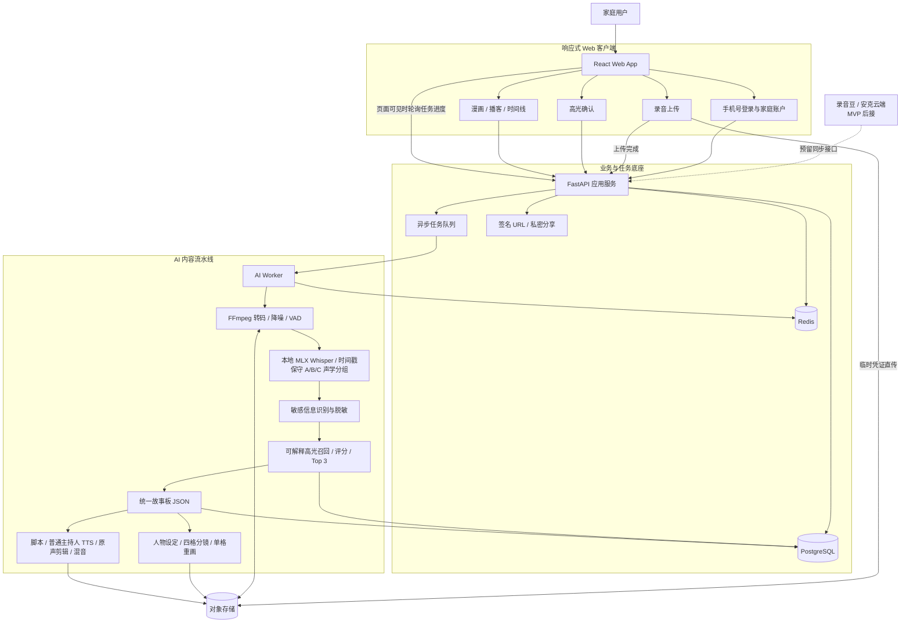
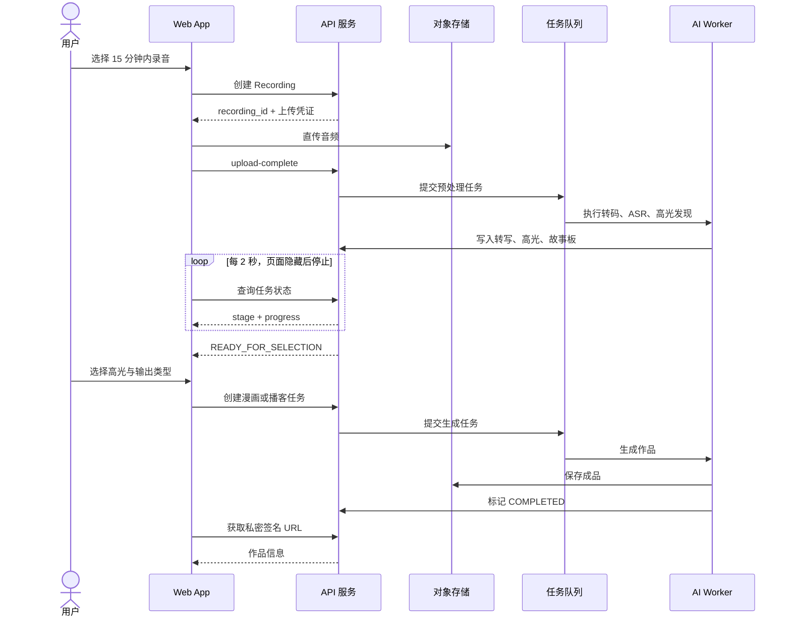

# 家庭故事豆 MVP 技术架构

## 1. 架构目标与边界

### 已冻结基线

- 产品形态：移动端优先的 Web App，本地 MVP 使用 HTTP，测试和生产使用 HTTPS。
- 输入：单个不超过 15 分钟的 MP3、M4A、WAV 或 AAC 文件。
- 核心输出：四格家庭漫画、2–3 分钟家庭播客。
- 处理方式：服务端异步处理，Web 页面可关闭后再次恢复进度。
- 内容原则：家庭成员直接引语必须可回溯到原始音频时间戳。
- 隐私原则：默认私密、短期签名访问、支持级联删除、不默认用于模型训练。

### MVP 不做

- 录音豆蓝牙直连、后台持续录音、实时分析。
- 真人级人脸复刻、家庭成员声音克隆。
- 公开社区、复杂编辑器、多种漫画风格。

## 2. 总体技术架构图



## 3. 录音处理时序



## 4. 部署拓扑

MVP 使用一套环境内的模块化单体，避免过早微服务化：

```text
api-service
├── auth          微信登录与会话
├── family        家庭与成员
├── recording     上传、录音元数据、删除
├── moment        高光与故事板
├── creation      漫画/播客项目
└── share         私密分享链接

ai-worker
├── audio         FFmpeg/VAD
├── transcription ASR/说话人分离
├── story         高光与故事板
├── comic         分镜/画面/文字合成
└── podcast       脚本/TTS/混音
```

生产部署至少包含：

- 1 个 API 容器，支持水平扩展。
- 1 个轻任务 Worker 与 1 个生成 Worker，防止图像生成阻塞转写任务。
- PostgreSQL、Redis、对象存储。
- 监控：任务成功率、阶段耗时、模型成本、删除结果、异常队列。

## 5. 核心数据模型

| 实体 | 关键字段 | 说明 |
|---|---|---|
| `users` | `openid`, `status` | 微信身份映射 |
| `families` | `owner_id`, `name` | 家庭空间 |
| `family_members` | `nickname`, `character_profile`, `voice_consent` | 人物卡和授权 |
| `recordings` | `duration_ms`, `scene_type`, `object_key`, `status`, `delete_at` | 原始录音 |
| `transcript_segments` | `speaker_key`, `start_ms`, `end_ms`, `text`, `confidence` | 可追溯转写 |
| `moments` | `score`, `storyboard_json`, `selected` | 高光与统一故事板 |
| `creations` | `type`, `version`, `status`, `title`, `metadata` | 漫画或播客，漫画元数据保存 `visual_bible` |
| `comic_panels` | `panel_index`, `source_segment_id`, `asset_url`, `version` | 四格内容、原话溯源与单格版本 |
| `podcast_moments` | `creation_id`, `moment_id`, `position` | 节目选用的 1–3 个高光及顺序 |
| `podcast_segments` | `kind`, `text`, `source_segment_id`, `start_ms`, `end_ms` | 区分 AI 旁白和可溯源家人原声 |
| `jobs` | `type`, `stage`, `progress`, `retry_count`, `error_code` | 异步任务 |
| `deletion_audits` | `scope`, `completed_at`, `result` | 删除审计，不保存已删内容 |

## 6. API 边界

```http
POST   /v1/auth/wechat
POST   /v1/families
GET    /v1/families/{familyId}
POST   /v1/families/{familyId}/members

POST   /v1/recordings
POST   /v1/recordings/{recordingId}/upload-complete
GET    /v1/recordings/{recordingId}
DELETE /v1/recordings/{recordingId}

GET    /v1/recordings/{recordingId}/moments
PATCH  /v1/moments/{momentId}
POST   /v1/moments/{momentId}/comics
GET    /v1/comics/{comicId}
POST   /v1/comics/{comicId}/panels/{panelIndex}/regenerate
POST   /v1/podcasts
GET    /v1/podcasts/{podcastId}
PATCH  /v1/podcasts/{podcastId}
POST   /v1/podcasts/{podcastId}/playback-url

GET    /v1/jobs/{jobId}
POST   /v1/jobs/{jobId}/retry
GET    /v1/creations/{creationId}
DELETE /v1/creations/{creationId}
POST   /v1/creations/{creationId}/share-links
```

## 7. 任务状态机

```text
CREATED
  → UPLOADING
  → UPLOADED
  → PREPROCESSING
  → TRANSCRIBING
  → ANALYZING
  → READY_FOR_SELECTION
  → GENERATING
  → COMPLETED
```

终止状态：`FAILED`、`CANCELLED`、`DELETED`。具体失败原因通过 `error_code` 区分，例如上传、转写或生成失败。

幂等键采用 `recording_id + stage + pipeline_version`。模型、提示词或处理规则变化时提升 `pipeline_version`，避免历史结果静默改变。

## 8. 安全与隐私

- 音频和作品不使用公开 URL；客户端通过短期签名 URL 访问。
- 原始录音默认 7 天删除，可由用户提前删除。
- 删除录音时级联删除转写、故事板、作品和对象存储文件。
- 上传完成前后分别校验文件类型、真实音频时长、文件摘要和所属家庭。
- 用户输入在进入 LLM 前进行手机号、地址等敏感信息脱敏。
- 家庭成员原话必须保存来源时间戳；生成内容和真实原声在 UI 中明确区分。
- 日志禁止记录音频正文、完整转写和签名 URL。

## 9. 关键降级策略

| 故障 | 降级行为 |
|---|---|
| 说话人分离失败 | 使用保守 A/B/C，由用户手动映射，不猜测真实身份 |
| 高光不足 | 返回完整转写的三个章节摘要供选择 |
| 图像生成失败 | 保留故事板，允许稍后重试，不影响播客 |
| TTS失败 | 生成无旁白的原声精剪版 |
| 单任务超时 | 进入重试队列，最多自动重试 2 次 |
| 模型服务不可用 | 暂停新生成并保留上传结果，不重复收费 |

## 10. 待验证依赖

1. 安克录音豆 SDK 是否能导出音频文件、时间戳和重点标记。
2. 正式环境微信文件上传与本地文件选择能力的当前限制。
3. ASR 对家庭多人重叠说话、儿童语音和环境噪声的实际表现。
4. 图像模型是否支持角色参考图及稳定的人物一致性。
5. 所选 TTS、音乐和图像服务的商业使用授权范围。
